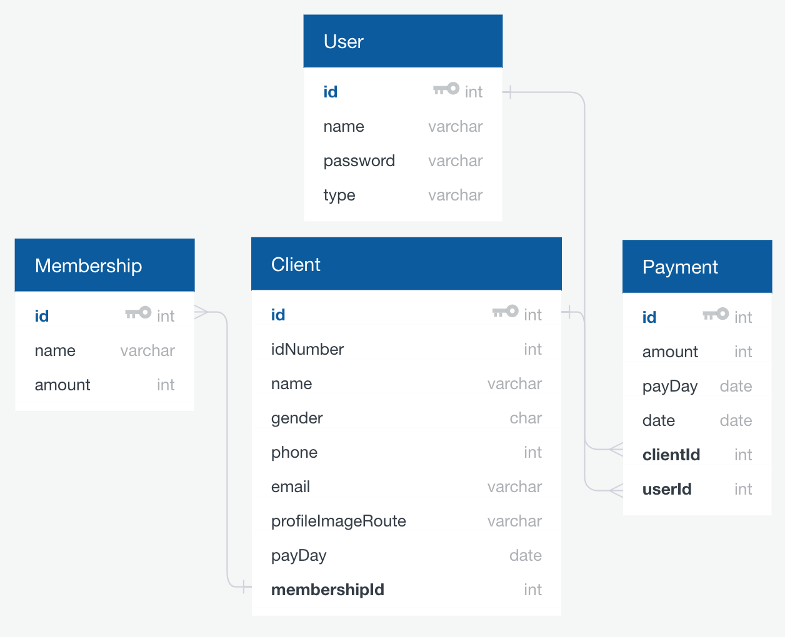

# Gimnasio-Server

Backend service for the [Gimnasio-Vue](https://github.com/kecoco16/Gimnasio-Vue) app.

### Prerequisites

- Install [Node.js](https://nodejs.org) lts version (8.11.3) or current Version: (10.7.0)
- Install [Postgres](https://www.postgresql.org/download/) 10

### Installing

```sh
npm i
```

## Getting Started

#### Database

Postgres offers a cli tool to create the database we need:

```sh
psql postgres
CREATE ROLE coco WITH LOGIN PASSWORD 'coco'; 
CREATE DATABASE gimnasio;
GRANT ALL PRIVILEGES ON DATABASE gimnasio TO coco;
\quit
```

If you want to change the name of any of these settings, you must change the database configuration in this [file](https://github.com/kecoco16/Gimnasio-Server/blob/master/src/commond/setup/index.js)

Then:

```sh
npm run db:setup
npm run db:examples
```


#### API
```sh
npm start
```

## Running the tests
 
```sh
npm test
```

Or:
#### Database

```sh
npm run db:test
```

#### API

```sh
npm run api:test
```

## Database Diagram 




## Authors

* **[Kevin Castillo](https://github.com/kecoco16/)** 

## License

This project is licensed under the MIT License - see the [LICENSE.md](LICENSE.md) file for details
